## Sparse Tables

Sparse tables are all about doing efficient **range queries** on **static arrays**. For example: min, max, sum, gcd.

For **associative functions**, a sparse table can answer range queries in $O(log_2n)$.

A function $f(x, y)$ is **associative** if $f(a, f(b, c)) = f(f(a, b), c)$ for all a, b, c.

Addition and multiplication are associative.
Subtraction and exponentiation are not:

<p align="center">
    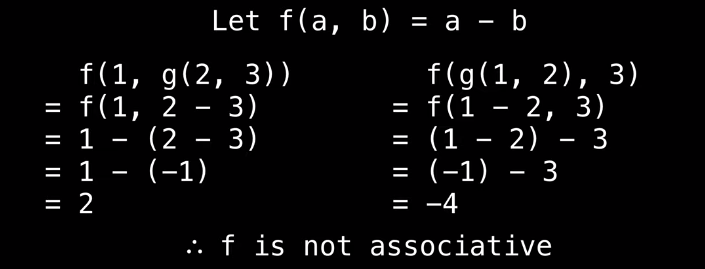
</p>

When the **range query combination function** is **overlap friendly**, then range queries on a sparse table can be answered in **O(1)**.

Being **overlap friendly** means that a function yields the same answer regardless of whether it is combining ranges which overlap or those that do not.

<p align="center">
    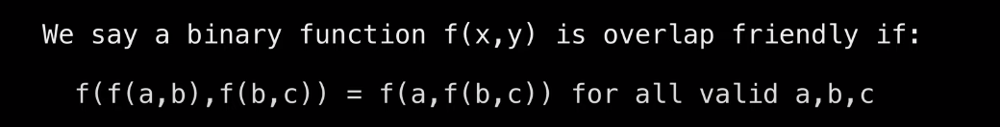
</p>

### Example:

<p align="center">
    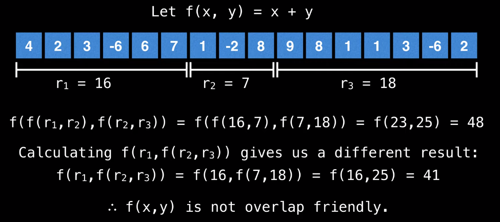
</p>

<p align="center">
    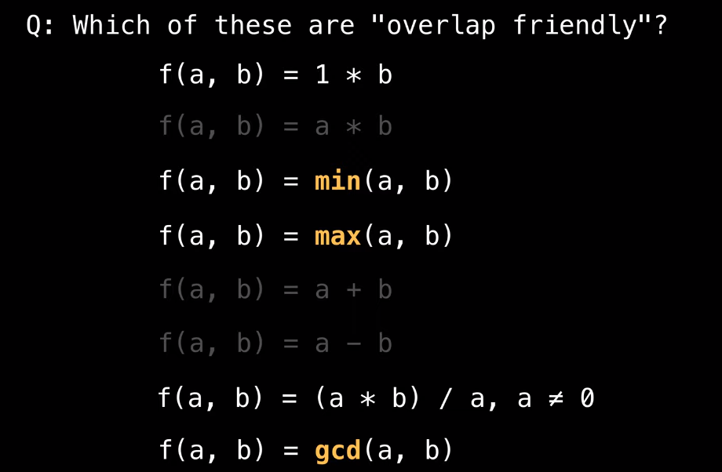
</p>

The idea behind a sparse table is to precompute answers for all intervals of size $2^x$ to efficiently answer range queries $[l, r]$

Let $N$ be the size of input value array, and let $2^P$ be the largest power of $2$ that fits in the length of the entire values array.

$$P = floor(log_2 N) = floor(log_2 13) = 3$$

<p align="center">
    
</p>

Begin by initializing a table with $P+1$ rows and N columns. Then, fill the first row with the input values.

Each cell $(i, j)$ represents the answer for the range $[j, j + 2^i)$ in the original array.

<p align="center">
    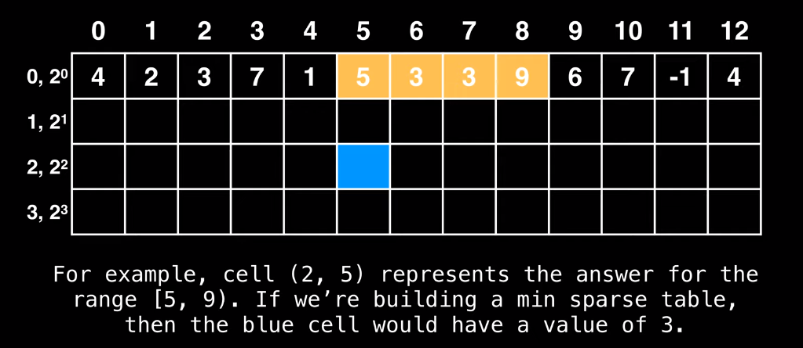
</p>

We do not need to consider cells with invalid intervals.

For example, we want to build a min sparse table to be able to do min range queries.

The range combination function will be $f(x, y) = min(x, y)$ and we will use it to combine range queries.

The way we are going to build the table is by reusing the already computed range values of previous cells.

The current cell $(i, j)$ represents the range $[j, j + 2^i)$ which always has even length. This range can be broken down into two sub intervals (which we will have already computed).

More specifically, the range for the cell $(i, j)$ can be split into a left interval $[j, j+2^{i-1})$ and a right interval $[j+2^{i-1}, j+2^{i})$ whose values would correspond to the cells $(i-1,j)$ and $(i-1, j+2^{i-1})$ respectively.

<p align="center">
    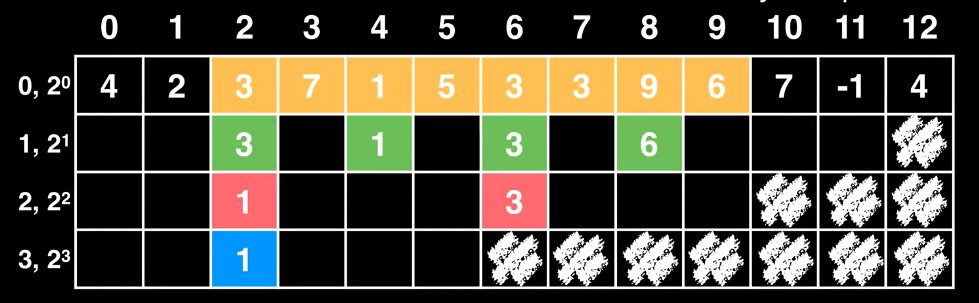
</p>

The blue cell consists of red cell values, red cell values consist of green cell values, etc.

**The dynamic programming idea:**

```java
dp[i][j] = f(dp[i-1][j], dp[i-1][j+2^(i-1)]) = min(dp[i-1][j], dp[i-1][j+2^(i-1)])
```

So how do we find a minimum value for a range?

In our table we have already precomputed the answer for all intervals of length $2^x$.

Let $k$ be the largest power of two that fits in the length of the range between $[l, r]$.

Knowing $k$ we can easily do a lookup in the table to find the minimum in between ranges $[l, l + k - 1]$ (**left interval**) and $[r - k + 1, r]$ (**right interval**) to find the answer for $[l, r]$. The left and the right intervals may overlap, but this does not matter (given the **overlap friendly property**) as long as the entire range is covered.

Example: what is the minimum value between $[1, 11]$?

1.  Find the value $p$, which gives the largest possible $2^p$ that fits the range $[1, 11]$:

    Interval length:

    $$len = l - r + 1 = 11 - 1 + 1 = 11$$

    $$p = floor(log_2 len) = floor(log_2 11) = floor(3.321) = 3$$

2.  Find k, which is $2^p$
    $$k = 2^p = 2^3 = 8$$

3.  Knowing $p$ and $k$ we can do a lookup for the left and right interval ranges:

    ```java
    min(t[p][l], t[p][r - k + 1])
    ```

    We are looking at row $p$ because we know that it is the maximum number which will fit $2^p$ in the interval --> two lookups are enough here (blue cells), and we do not need to combine 4 interval lookups if we looked at the second row, for example.

    ```
    min(t[3][1], t[3][11 - 8 + 1])

    min(t[3][1], t[3][4])

    min(1, -1)

    = -1
    ```

    <p align="center">
       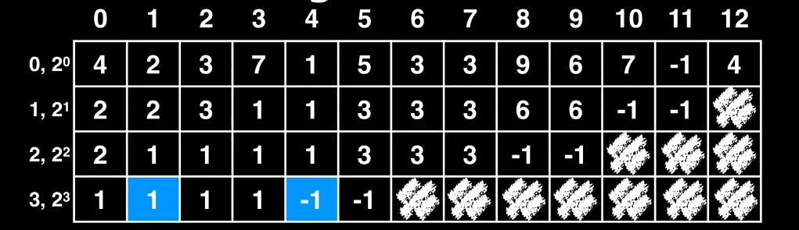
    </p>

Some functions such as multiplication and summation are **associative**, but not overlap friendly. A sparse table can still handle these types of queries, but in $O(log_2 n)$ rather than $O(1)$. The issue is that overlapping intervals would yield the wrong answer.

The alternative approach to performaing a range query is to do a _cascading query_ on the sparse table by breaking the range $[l, r]$ into smaller ranges of size $2^x$ which **do not overlap**.

Example of an **associative function query**:

Consider an input array [1, 2, -3, 2, 4, -1, 5]

Suppose we want to find the product of all elements between $[0, 6]$ using a sparse table. First, we would construct a sparse table like we did before:

<p align="center">
    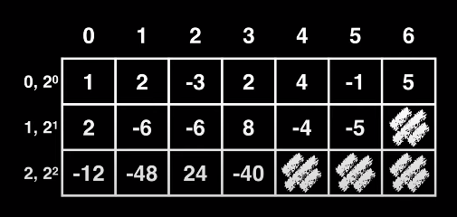
</p>

1. Break interval $[0, 6]$ into powers of 2: $[0, 2^2) \cup [4, 4 + 2^1) \cup [6, 6 + 2^0)$. Important: always start with the **largest power** of 2 fitting in the interval.
2. Lookup the value of each interval in the table and take the product of all the intervals: $table[2][0] * table[1][4] * table[0][6] = -12 * -4 * 5 = 240$

### Pseudocode:

<p align="center">
    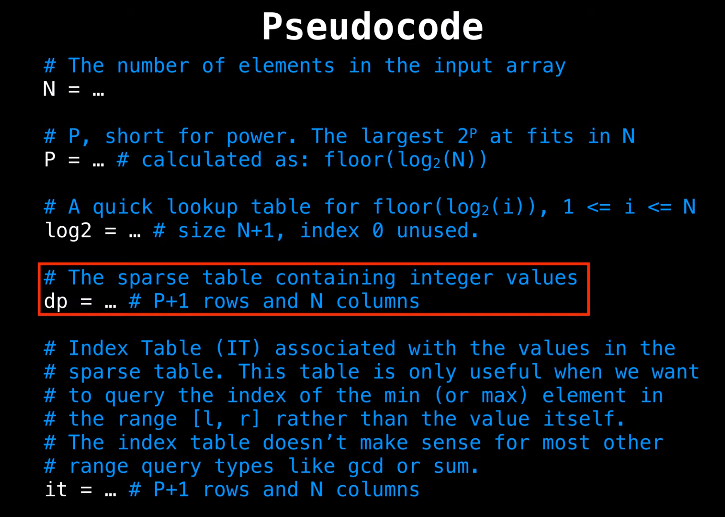
</p>

<p align="center">
    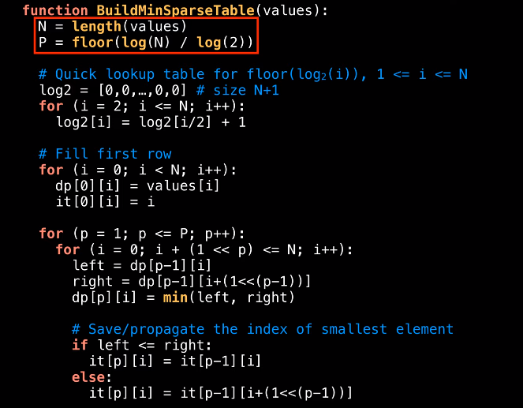
</p>

<p align="center">
    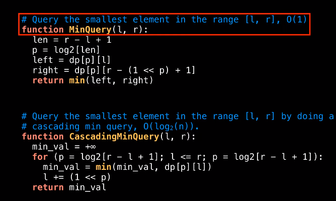
</p>

<p align="center">
    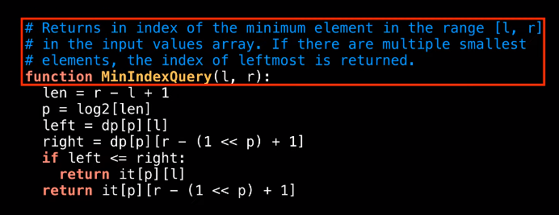
</p>

### Source Code:

```java
/**
 * Min sparse table example
 *
 * <p>Download the code: <br>
 * $ git clone https://github.com/williamfiset/algorithms
 *
 * <p>Run: <br>
 * $ ./gradlew run -Palgorithm=datastructures.sparsetable.examples.MinSparseTable
 *
 * <p>Construction complexity: O(nlogn), query complexity: O(1)
 *
 * @author William Fiset, william.alexandre.fiset@gmail.com
 */
package com.williamfiset.algorithms.datastructures.sparsetable.examples;

// Sparse table for efficient minimum range queries in O(1) with O(nlogn) space
public class MinSparseTable {

  // Example usage:
  public static void main(String[] args) {
    // index values: 0, 1,  2, 3, 4,  5, 6
    long[] values = {1, 2, -3, 2, 4, -1, 5};
    MinSparseTable sparseTable = new MinSparseTable(values);

    System.out.println(sparseTable.queryMin(1, 5)); // prints -3
    System.out.println(sparseTable.queryMinIndex(1, 5)); // prints 2

    System.out.println(sparseTable.queryMin(3, 3)); // prints 2
    System.out.println(sparseTable.queryMinIndex(3, 3)); // prints 3

    System.out.println(sparseTable.queryMin(3, 6)); // prints -1
    System.out.println(sparseTable.queryMinIndex(3, 6)); // prints 5
  }

  // The number of elements in the original input array.
  private int n;

  // The maximum power of 2 needed. This value is floor(log2(n))
  private int P;

  // Fast log base 2 logarithm lookup table, 1 <= i <= n
  private int[] log2;

  // The sparse table values.
  private long[][] dp;

  // Index Table (IT) associated with the values in the sparse table. This table
  // is only useful when we want to query the index of the min (or max) element
  // in the range [l, r] rather than the value itself. The index table doesn’t
  // make sense for most other range query types like gcd or sum.
  private int[][] it;

  public MinSparseTable(long[] values) {
    n = values.length;
    P = (int) (Math.log(n) / Math.log(2));
    dp = new long[P + 1][n];
    it = new int[P + 1][n];

    for (int i = 0; i < n; i++) {
      dp[0][i] = values[i];
      it[0][i] = i;
    }

    log2 = new int[n + 1];
    for (int i = 2; i <= n; i++) {
      log2[i] = log2[i / 2] + 1;
    }

    // Build sparse table combining the values of the previous intervals.
    for (int p = 1; p <= P; p++) {
      for (int i = 0; i + (1 << p) <= n; i++) {
        long leftInterval = dp[p - 1][i];
        long rightInterval = dp[p - 1][i + (1 << (p - 1))];
        dp[p][i] = Math.min(leftInterval, rightInterval);

        // Propagate the index of the best value
        if (leftInterval <= rightInterval) {
          it[p][i] = it[p - 1][i];
        } else {
          it[p][i] = it[p - 1][i + (1 << (p - 1))];
        }
      }
    }
  }

  // Do a min query on the interval [l, r] in O(1).
  //
  // We can get O(1) query by finding the smallest power of 2 that fits within
  // the interval length which we'll call k. Then we can query the intervals
  // [l, l+k] and [r-k+1, r] (which likely overlap) and apply the function
  // again. Some functions (like min and max) don't care about overlapping
  // intervals so this trick works, but for a function like sum this would
  // return the wrong result since it is not an idempotent binary function
  // (aka an overlap friendly function).
  private long queryMin(int l, int r) {
    int length = r - l + 1;
    int p = log2[length];
    int k = 1 << p; // 2 to the power of p
    return Math.min(dp[p][l], dp[p][r - k + 1]);
  }

  // Returns the index of the minimum element in the range [l, r].
  public int queryMinIndex(int l, int r) {
    int length = r - l + 1;
    int p = log2[length];
    int k = 1 << p; // 2 to the power of p
    long leftInterval = dp[p][l];
    long rightInterval = dp[p][r - k + 1];
    if (leftInterval <= rightInterval) {
      return it[p][l];
    } else {
      return it[p][r - k + 1];
    }
  }
}
```
