## Balanced Binary Search Trees (BBST)

A **Balanced Binary Search Tree** (BBST) is a **self-balancing** binary search tree. This type of tree will adjust itself in order to maintain a low (logarithmic) height allowing for faster operations such as insertions and deletions.

**Complexity of BSTs:**

| Operation |  Average  | Worst |
| --------- | :-------: | ----: |
| Insert    | O(log(n)) |  O(n) |
| Delete    | O(log(n)) |  O(n) |
| Remove    | O(log(n)) |  O(n) |
| Search    | O(log(n)) |  O(n) |

**Complexity of BBSTs:**

| Operation |  Average  |     Worst |
| --------- | :-------: | --------: |
| Insert    | O(log(n)) | O(log(n)) |
| Delete    | O(log(n)) | O(log(n)) |
| Remove    | O(log(n)) | O(log(n)) |
| Search    | O(log(n)) | O(log(n)) |

### Tree Rotations

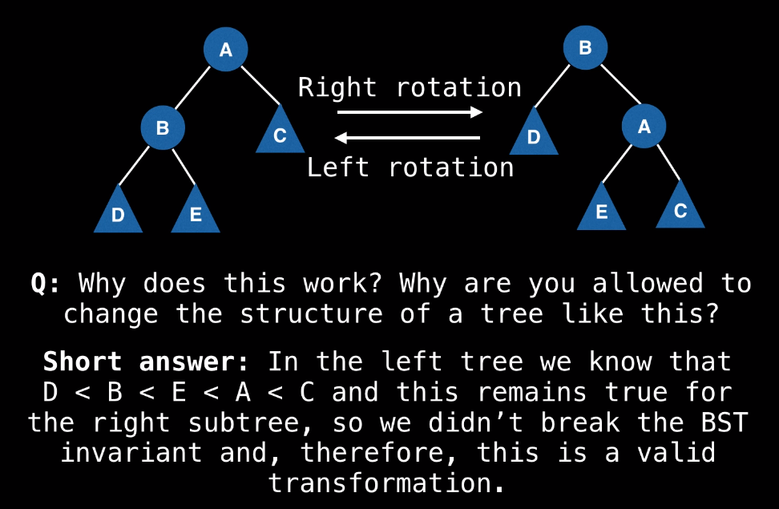

**Long answer:** recall that all BBSTs are BSTs so the BST invariant holds. Thus, we can shuffle/transform/rotate the values and nodes in the tree as we please as long as the BST invariant remains satisfied.

```java
function rightRotate(A):
    B := A.left
    A.left = B.right
    B.right = A
    return B
```

**Note:** It is possible that before the rotation node A had a parent whose left/right pointer referenced A. It is important that this link is updated to reference B. This is usually done on the recursive callback using the return value of rotateRight.

In some implementations of BBSTs nodes have pointers to parents. This complicates tree rotations because instead of updating three pointers, we have to update six now.

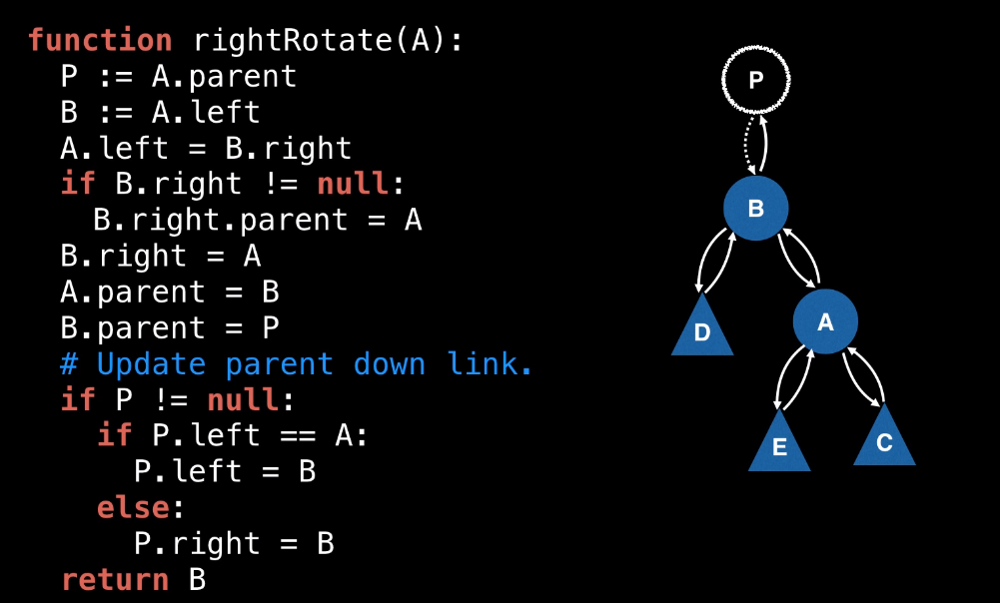

## AVL Trees

An **AVL tree** is one of the many **types of BBSTs** which allow for logarithmic **O(log(n))** insertion, deletion, and search operations.

The property that keeps an AVL tree balanced is called the **Balanced Factor (BF)**:

<div align="center">
BF(node) = H(node.right) - H(node.left)
</div>

Where H(x) is the height of node H. The hight of node x is calculated as the number of edges between x and the furthest leaf.

**For the AVL tree, BF has to always be either -1, 0, or +1**

If node's $BF \notin$ $\{-1, 0, +1\}$ then the BF of that node is $\pm 2$ which can be adjusted using **tree rotations**.

### 4 cases:

1. **Left-Left case**:
   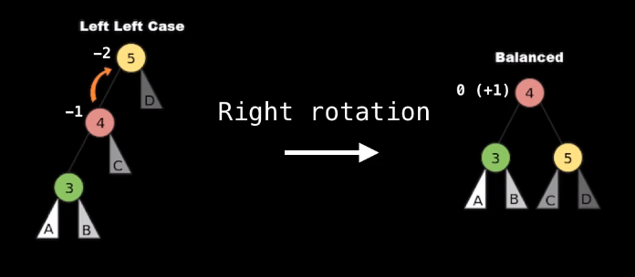
2. **Left-Right case**:
   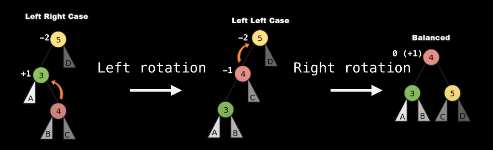
3. **Right-Right case**:
   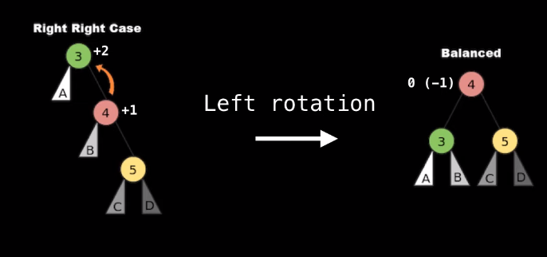
4. **Right-Left case**:
   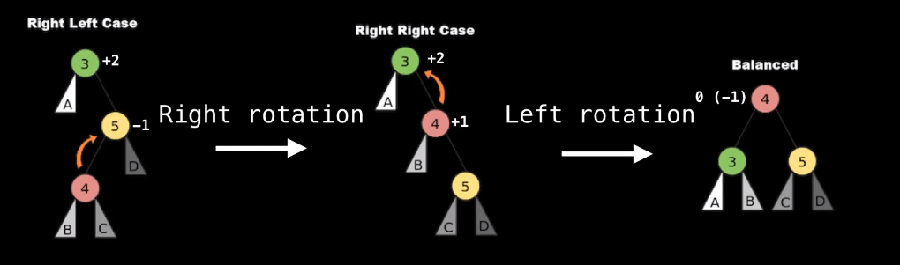

### Inserting Nodes in the AVL Tree:

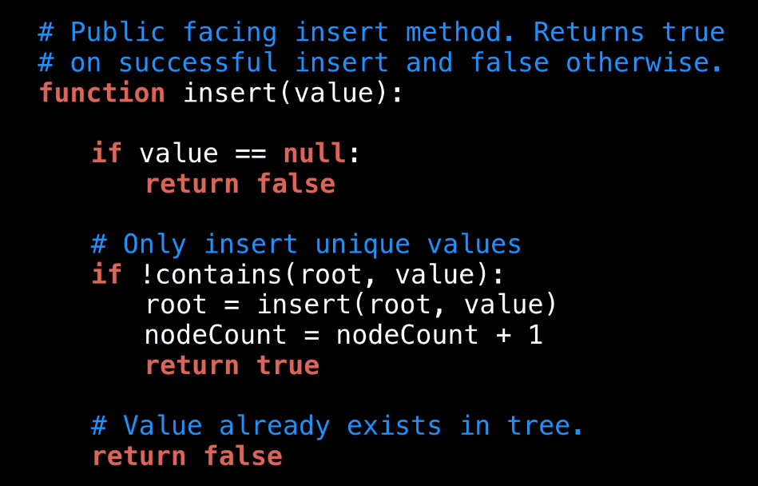

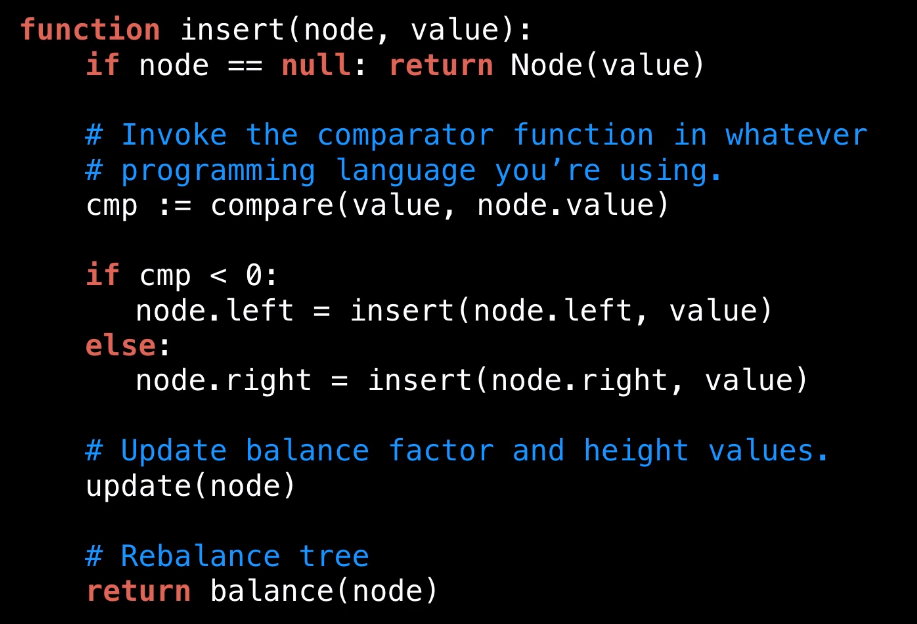

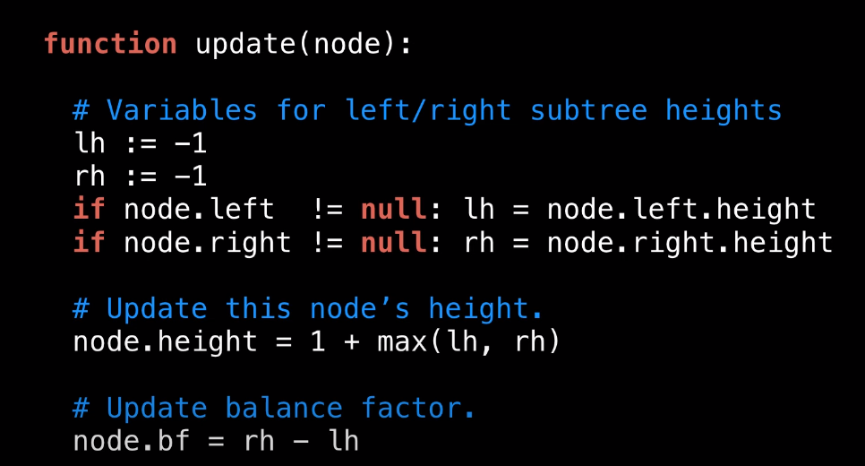

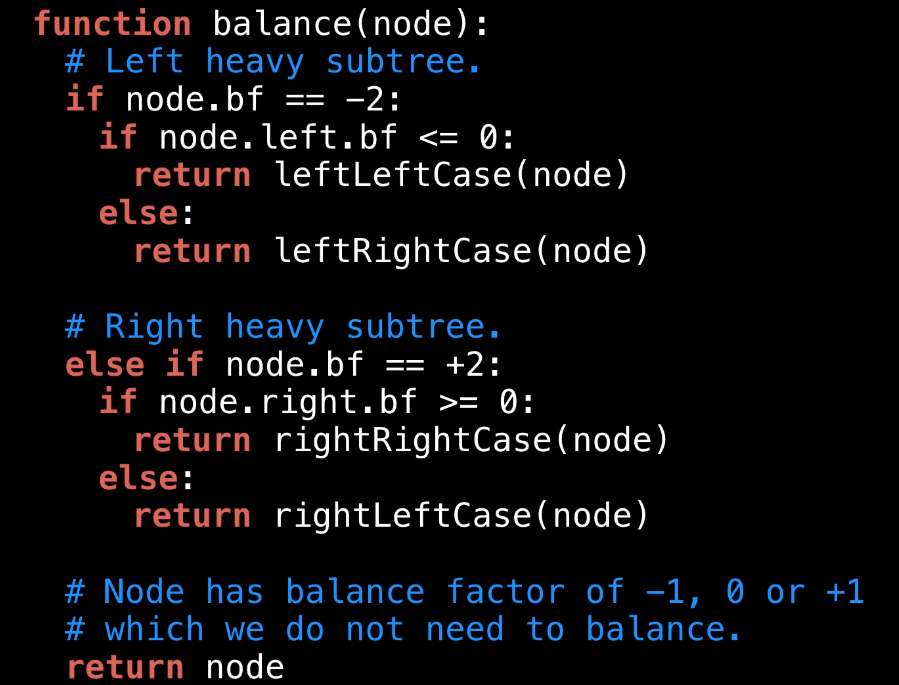

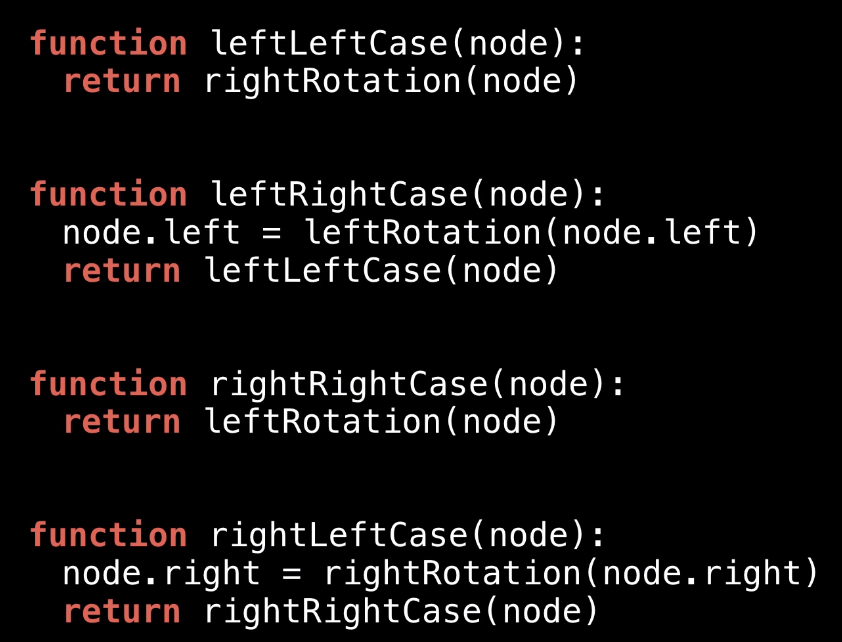

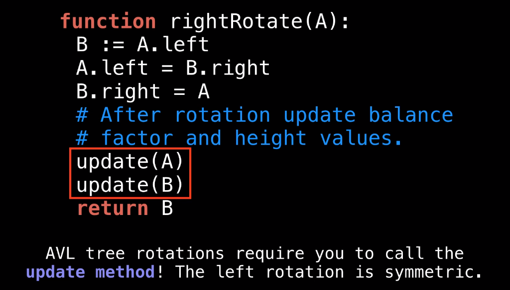

### Removing Nodes in the AVL Tree:

Same as for BST trees + some augmentation:

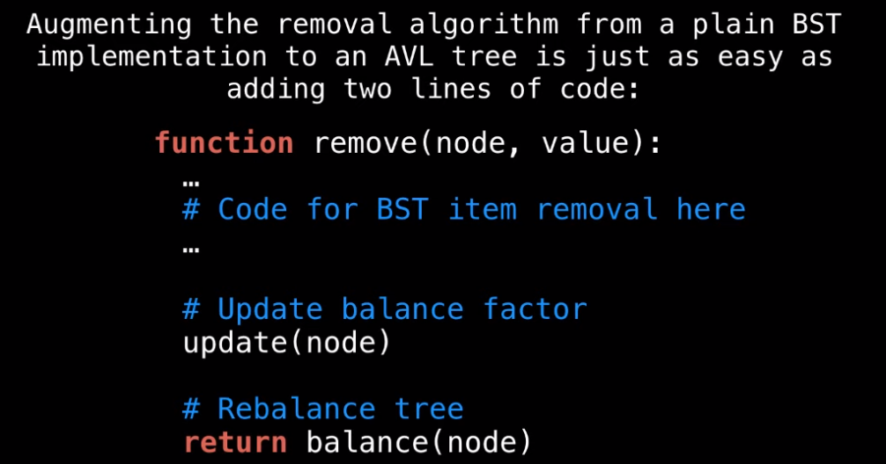

JAVA AVL TREE CODE

```java
/**
 * This file contains an implementation of an AVL tree. An AVL tree is a special type of binary tree
 * which self balances itself to keep operations logarithmic.
 *
 * @author William Fiset, william.alexandre.fiset@gmail.com
 */
package com.williamfiset.algorithms.datastructures.balancedtree;

import com.williamfiset.algorithms.datastructures.utils.TreePrinter;
import com.williamfiset.algorithms.datastructures.utils.TreePrinter.PrintableNode;

public class AVLTreeRecursive<T extends Comparable<T>> implements Iterable<T> {

  public class Node implements PrintableNode {

    // 'bf' is short for Balance Factor
    public int bf;

    // The value/data contained within the node.
    public T value;

    // The height of this node in the tree.
    public int height;

    // The left and the right children of this node.
    public Node left, right;

    public Node(T value) {
      this.value = value;
    }

    @Override
    public PrintableNode getLeft() {
      return left;
    }

    @Override
    public PrintableNode getRight() {
      return right;
    }

    @Override
    public String getText() {
      return value.toString();
    }
  }

  // The root node of the AVL tree.
  public Node root;

  // Tracks the number of nodes inside the tree.
  private int nodeCount = 0;

  // The height of a rooted tree is the number of edges between the tree's
  // root and its furthest leaf. This means that a tree containing a single
  // node has a height of 0.
  public int height() {
    if (root == null) return 0;
    return root.height;
  }

  // Returns the number of nodes in the tree.
  public int size() {
    return nodeCount;
  }

  // Returns whether or not the tree is empty.
  public boolean isEmpty() {
    return size() == 0;
  }

  // Return true/false depending on whether a value exists in the tree.
  public boolean contains(T value) {
    return contains(root, value);
  }

  // Recursive contains helper method.
  private boolean contains(Node node, T value) {
    if (node == null) return false;

    // Compare current value to the value in the node.
    int cmp = value.compareTo(node.value);

    // Dig into left subtree.
    if (cmp < 0) return contains(node.left, value);

    // Dig into right subtree.
    if (cmp > 0) return contains(node.right, value);

    // Found value in tree.
    return true;
  }

  // Insert/add a value to the AVL tree. The value must not be null, O(log(n))
  public boolean insert(T value) {
    if (value == null) return false;
    if (!contains(root, value)) {
      root = insert(root, value);
      nodeCount++;
      return true;
    }
    return false;
  }

  // Inserts a value inside the AVL tree.
  private Node insert(Node node, T value) {
    // Base case.
    if (node == null) return new Node(value);

    // Compare current value to the value in the node.
    int cmp = value.compareTo(node.value);

    // Insert node in left subtree.
    if (cmp < 0) {
      node.left = insert(node.left, value);

      // Insert node in right subtree.
    } else {
      node.right = insert(node.right, value);
    }

    // Update balance factor and height values.
    update(node);

    // Re-balance tree.
    return balance(node);
  }

  // Update a node's height and balance factor.
  private void update(Node node) {
    int leftNodeHeight = (node.left == null) ? -1 : node.left.height;
    int rightNodeHeight = (node.right == null) ? -1 : node.right.height;

    // Update this node's height.
    node.height = 1 + Math.max(leftNodeHeight, rightNodeHeight);

    // Update balance factor.
    node.bf = rightNodeHeight - leftNodeHeight;
  }

  // Re-balance a node if its balance factor is +2 or -2.
  private Node balance(Node node) {
    // Left heavy subtree.
    if (node.bf == -2) {

      // Left-Left case.
      if (node.left.bf <= 0) {
        return leftLeftCase(node);

        // Left-Right case.
      } else {
        return leftRightCase(node);
      }

      // Right heavy subtree needs balancing.
    } else if (node.bf == +2) {

      // Right-Right case.
      if (node.right.bf >= 0) {
        return rightRightCase(node);

        // Right-Left case.
      } else {
        return rightLeftCase(node);
      }
    }

    // Node either has a balance factor of 0, +1 or -1 which is fine.
    return node;
  }

  private Node leftLeftCase(Node node) {
    return rightRotation(node);
  }

  private Node leftRightCase(Node node) {
    node.left = leftRotation(node.left);
    return leftLeftCase(node);
  }

  private Node rightRightCase(Node node) {
    return leftRotation(node);
  }

  private Node rightLeftCase(Node node) {
    node.right = rightRotation(node.right);
    return rightRightCase(node);
  }

  private Node leftRotation(Node node) {
    Node newParent = node.right;
    node.right = newParent.left;
    newParent.left = node;
    update(node);
    update(newParent);
    return newParent;
  }

  private Node rightRotation(Node node) {
    Node newParent = node.left;
    node.left = newParent.right;
    newParent.right = node;
    update(node);
    update(newParent);
    return newParent;
  }

  // Remove a value from this binary tree if it exists, O(log(n))
  public boolean remove(T elem) {
    if (elem == null) return false;

    if (contains(root, elem)) {
      root = remove(root, elem);
      nodeCount--;
      return true;
    }

    return false;
  }

  // Removes a value from the AVL tree.
  private Node remove(Node node, T elem) {
    if (node == null) return null;

    int cmp = elem.compareTo(node.value);

    // Dig into left subtree, the value we're looking
    // for is smaller than the current value.
    if (cmp < 0) {
      node.left = remove(node.left, elem);

      // Dig into right subtree, the value we're looking
      // for is greater than the current value.
    } else if (cmp > 0) {
      node.right = remove(node.right, elem);

      // Found the node we wish to remove.
    } else {

      // This is the case with only a right subtree or no subtree at all.
      // In this situation just swap the node we wish to remove
      // with its right child.
      if (node.left == null) {
        return node.right;

        // This is the case with only a left subtree or
        // no subtree at all. In this situation just
        // swap the node we wish to remove with its left child.
      } else if (node.right == null) {
        return node.left;

        // When removing a node from a binary tree with two links the
        // successor of the node being removed can either be the largest
        // value in the left subtree or the smallest value in the right
        // subtree. As a heuristic, I will remove from the subtree with
        // the greatest height in hopes that this may help with balancing.
      } else {

        // Choose to remove from left subtree
        if (node.left.height > node.right.height) {

          // Swap the value of the successor into the node.
          T successorValue = findMax(node.left);
          node.value = successorValue;

          // Find the largest node in the left subtree.
          node.left = remove(node.left, successorValue);

        } else {

          // Swap the value of the successor into the node.
          T successorValue = findMin(node.right);
          node.value = successorValue;

          // Go into the right subtree and remove the leftmost node we
          // found and swapped data with. This prevents us from having
          // two nodes in our tree with the same value.
          node.right = remove(node.right, successorValue);
        }
      }
    }

    // Update balance factor and height values.
    update(node);

    // Re-balance tree.
    return balance(node);
  }

  // Helper method to find the leftmost node (which has the smallest value)
  private T findMin(Node node) {
    while (node.left != null) node = node.left;
    return node.value;
  }

  // Helper method to find the rightmost node (which has the largest value)
  private T findMax(Node node) {
    while (node.right != null) node = node.right;
    return node.value;
  }

  // Returns as iterator to traverse the tree in order.
  public java.util.Iterator<T> iterator() {

    final int expectedNodeCount = nodeCount;
    final java.util.Stack<Node> stack = new java.util.Stack<>();
    stack.push(root);

    return new java.util.Iterator<T>() {
      Node trav = root;

      @Override
      public boolean hasNext() {
        if (expectedNodeCount != nodeCount) throw new java.util.ConcurrentModificationException();
        return root != null && !stack.isEmpty();
      }

      @Override
      public T next() {

        if (expectedNodeCount != nodeCount) throw new java.util.ConcurrentModificationException();

        while (trav != null && trav.left != null) {
          stack.push(trav.left);
          trav = trav.left;
        }

        Node node = stack.pop();

        if (node.right != null) {
          stack.push(node.right);
          trav = node.right;
        }

        return node.value;
      }

      @Override
      public void remove() {
        throw new UnsupportedOperationException();
      }
    };
  }

  @Override
  public String toString() {
    return TreePrinter.getTreeDisplay(root);
  }

  // Make sure all left child nodes are smaller in value than their parent and
  // make sure all right child nodes are greater in value than their parent.
  // (Used only for testing)
  public boolean validateBSTInvarient(Node node) {
    if (node == null) return true;
    T val = node.value;
    boolean isValid = true;
    if (node.left != null) isValid = isValid && node.left.value.compareTo(val) < 0;
    if (node.right != null) isValid = isValid && node.right.value.compareTo(val) > 0;
    return isValid && validateBSTInvarient(node.left) && validateBSTInvarient(node.right);
  }
}
```
