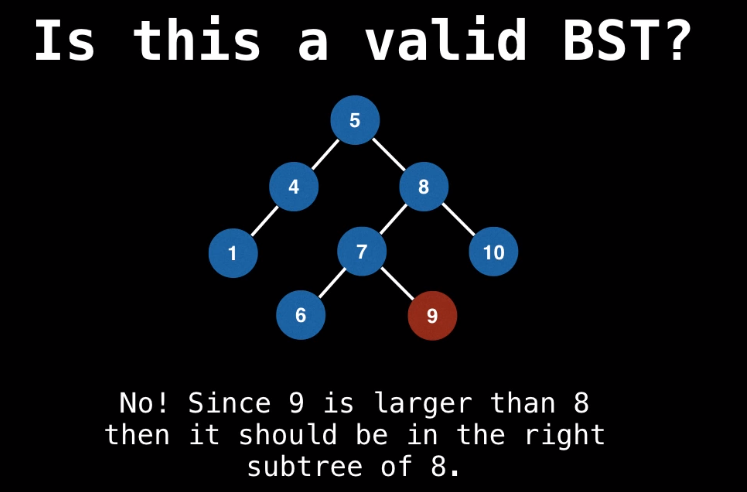
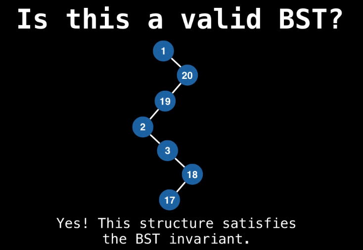
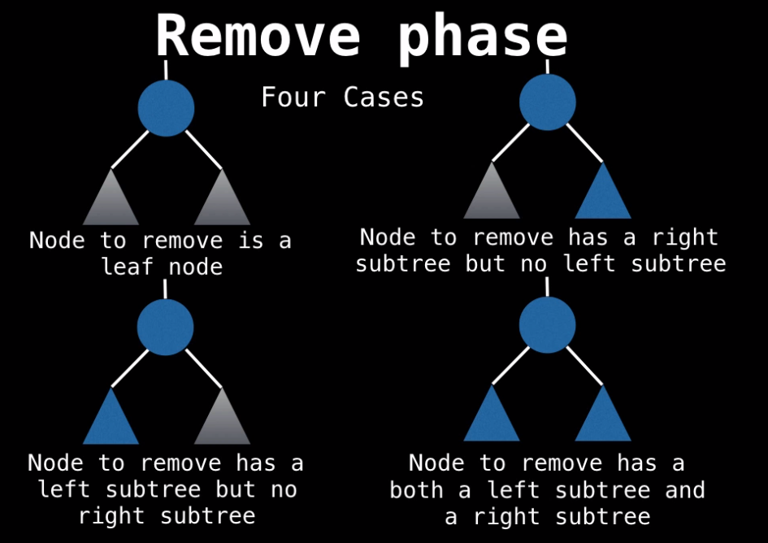
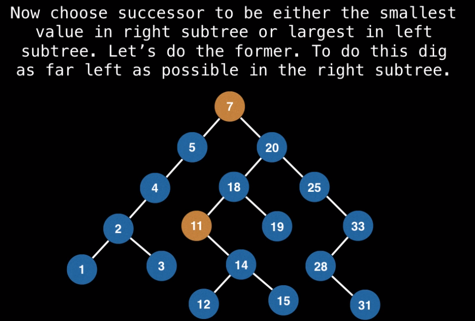
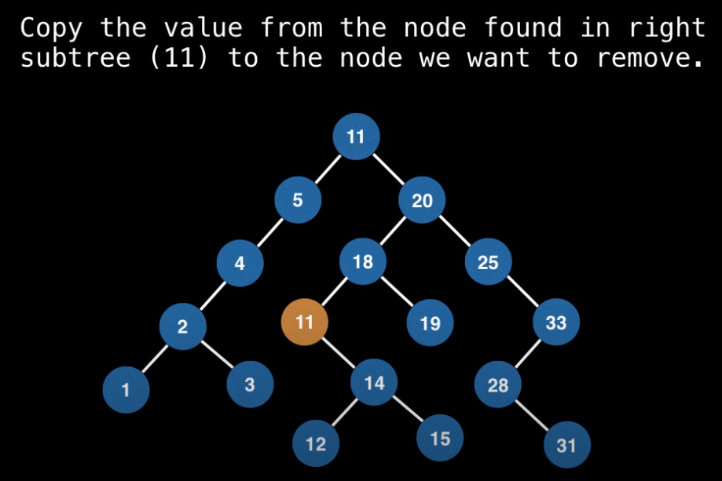
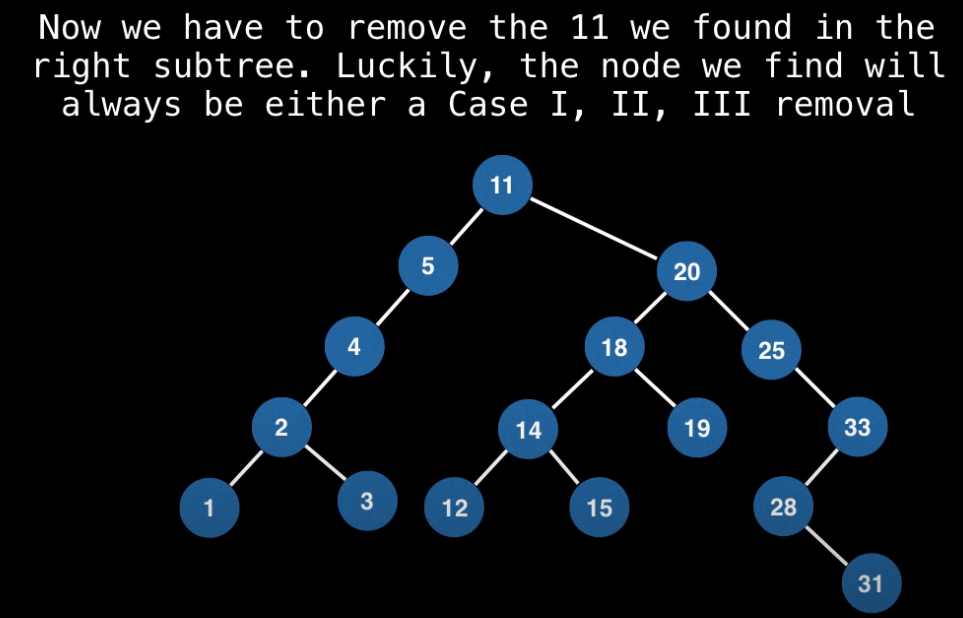
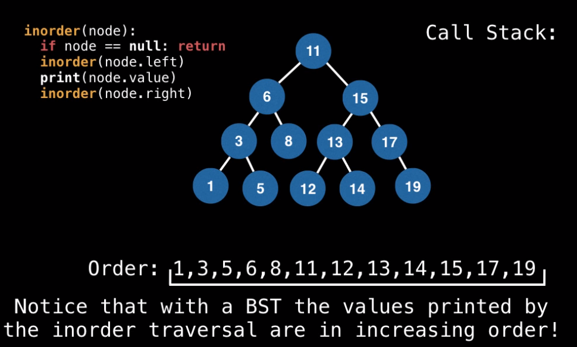

## Binary Trees and Binary Search Trees (BST)

A **binary tree** is a tree for which every node has at most two child nodes.

A **binary search tree** is a binary tree that satisfies the **BST invariant**: left subtree has smaller elements and right subtree has larger elements.

BST operations allow for duplicate values, but most of the time we are only interested in having unique elements inside of our tree.

### Examples:





**Complexity of BSTs:**

| Operation |  Average  | Worst |
| --------- | :-------: | ----: |
| Insert    | O(log(n)) |  O(n) |
| Delete    | O(log(n)) |  O(n) |
| Remove    | O(log(n)) |  O(n) |
| Search    | O(log(n)) |  O(n) |

### BST Insertion

When inserting an element in BST, we want to compare its value to the value stored in the current node we are considering. Based on that, we will decide on one of the following:

- Recurse down the left subtree (< case)
- Recurse down the right subtree (> case)
- Handle finding a duplicate value (= case)
- Create a new node (found a null leaf)

On average, the insertion time will be logarithmic. But in the worst case, this could degrade to **linear** time:

- insert(1)
- insert(2)
- insert(3)
- insert(4)
- insert(5)
- insert(6)

This is the reason why **Balanced Binary Search Trees** were invented.

### BST Removal

Removing from a BST can be seen as two step process:

1. Find the element we want to remove (if it exists)
   One of the following things can happen here:
   - We hit a **null node** at which point we know that this value does not exist within our BST.
   - Comparator value **equal to 0** (we have found it)
   - Comparator value **less than 0** (the value, if it exists, is in the left subtree)
   - Comparator value **greater than 0** (the value, if it exists, is in the right subtree)
2. Replace the node we want to remove with its successor (if any) to maintain the **BST invariant**



### Case 1: Leaf Node

No side effects

### Case II and III: either the left/right child node is a subtree

The successor of the node we are trying to remove in these cases will be the **root node of the left/right subtree**.

It may be the case that you are removing the root node of the BST in which case its immediate child becomes the new root as you would expect.

### Case IV: node to remove has both left and right subtrees

Q: In which subtree the successor of the node we are trying to remove be?

A: The answer is **both**. The successor can either be the **largest value in the left subtree** OR the **smallest value in the right subtree** (SO IT COULD BE BOTH).

Thus, there are 2 possible successors.

Example: Let's remove 7







The removal of duplicate successor can be done recursively with the same function.

### Tree Traversals

1. V: visit the node
2. L: traverse the left subtree of the node
3. R: traverse the right subtree of the node

**Pre-order Traversal:** The pre-order traversal is a special case of the **depth-first traversal**. In the pre-order traversal, we start at the root, and then perform the above operations in the order: **VLR**. That is, every node is visited before both of its subtrees, and then we always traverse the left subtree before the right subtree.

**In-order Traversal:** The in-order traversal performs the traversal operations in the sequence: **LVR**, starting at the root. That is, the left subtree of a node is always traversed before the node is visited, and the right subtree of a node is always traversed after the node is visited. **In-order traversal is neither breadth-first, nor depth-first traversal**.

**In-order traversal on BSTs:** values are printed in the increasing order.



**Post-order Traversal:** The post-order traversal starts at the root and performs the traversal operations in the sequence: **LRV**. That is, both the left and right subtrees of a node t are traversed before t is visited. Again, this is **neither a breadth-first, nor depth-first traversal**.


[Binary Search Tree Traversals VIDEO](https://www.youtube.com/watch?v=k7GkEbECZK0&list=PLDV1Zeh2NRsCYY48kOkeLQ-cg9-eqInzs&index=4&ab_channel=WilliamFiset)

[BST Data Structure JAVA](https://github.com/williamfiset/Algorithms/blob/master/src/main/java/com/williamfiset/algorithms/datastructures/binarysearchtree/BinarySearchTree.java)

BST CODE JAVA

```java
/**
 * This file contains an implementation of a Binary Search Tree (BST) Any comparable data is allowed
 * within this tree (numbers, strings, comparable Objects, etc...). Supported operations include
 * adding, removing, height, and containment checks. Furthermore, multiple tree traversal Iterators
 * are provided including: 1) Preorder traversal 2) Inorder traversal 3) Postorder traversal 4)
 * Levelorder traversal
 *
 * @author William Fiset, william.alexandre.fiset@gmail.com
 */
package com.williamfiset.algorithms.datastructures.binarysearchtree;

public class BinarySearchTree<T extends Comparable<T>> {

  // Tracks the number of nodes in this BST
  private int nodeCount = 0;

  // This BST is a rooted tree so we maintain a handle on the root node
  private Node root = null;

  // Internal node containing node references
  // and the actual node data
  private class Node {
    T data;
    Node left, right;

    public Node(Node left, Node right, T elem) {
      this.data = elem;
      this.left = left;
      this.right = right;
    }
  }

  // Check if this binary tree is empty
  public boolean isEmpty() {
    return size() == 0;
  }

  // Get the number of nodes in this binary tree
  public int size() {
    return nodeCount;
  }

  // Add an element to this binary tree. Returns true
  // if we successfully perform an insertion
  public boolean add(T elem) {

    // Check if the value already exists in this
    // binary tree, if it does ignore adding it
    if (contains(elem)) {
      return false;

      // Otherwise add this element to the binary tree
    } else {
      root = add(root, elem);
      nodeCount++;
      return true;
    }
  }

  // Private method to recursively add a value in the binary tree
  private Node add(Node node, T elem) {

    // Base case: found a leaf node
    if (node == null) {
      node = new Node(null, null, elem);

    } else {
      // Pick a subtree to insert element
      if (elem.compareTo(node.data) < 0) {
        node.left = add(node.left, elem);
      } else {
        node.right = add(node.right, elem);
      }
    }

    return node;
  }

  // Remove a value from this binary tree if it exists, O(n)
  public boolean remove(T elem) {

    // Make sure the node we want to remove
    // actually exists before we remove it
    if (contains(elem)) {
      root = remove(root, elem);
      nodeCount--;
      return true;
    }
    return false;
  }

  private Node remove(Node node, T elem) {

    if (node == null) return null;

    int cmp = elem.compareTo(node.data);

    // Dig into left subtree, the value we're looking
    // for is smaller than the current value
    if (cmp < 0) {
      node.left = remove(node.left, elem);

      // Dig into right subtree, the value we're looking
      // for is greater than the current value
    } else if (cmp > 0) {
      node.right = remove(node.right, elem);

      // Found the node we wish to remove
    } else {

      // This is the case with only a right subtree or
      // no subtree at all. In this situation just
      // swap the node we wish to remove with its right child.
      if (node.left == null) {
        return node.right;

        // This is the case with only a left subtree or
        // no subtree at all. In this situation just
        // swap the node we wish to remove with its left child.
      } else if (node.right == null) {

        return node.left;

        // When removing a node from a binary tree with two links the
        // successor of the node being removed can either be the largest
        // value in the left subtree or the smallest value in the right
        // subtree. In this implementation I have decided to find the
        // smallest value in the right subtree which can be found by
        // traversing as far left as possible in the right subtree.
      } else {

        // Find the leftmost node in the right subtree
        Node tmp = findMin(node.right);

        // Swap the data
        node.data = tmp.data;

        // Go into the right subtree and remove the leftmost node we
        // found and swapped data with. This prevents us from having
        // two nodes in our tree with the same value.
        node.right = remove(node.right, tmp.data);

        // If instead we wanted to find the largest node in the left
        // subtree as opposed to smallest node in the right subtree
        // here is what we would do:
        // Node tmp = findMax(node.left);
        // node.data = tmp.data;
        // node.left = remove(node.left, tmp.data);

      }
    }

    return node;
  }

  // Helper method to find the leftmost node (which has the smallest value)
  private Node findMin(Node node) {
    while (node.left != null) node = node.left;
    return node;
  }

  // Helper method to find the rightmost node (which has the largest value)
  private Node findMax(Node node) {
    while (node.right != null) node = node.right;
    return node;
  }

  // returns true is the element exists in the tree
  public boolean contains(T elem) {
    return contains(root, elem);
  }

  // private recursive method to find an element in the tree
  private boolean contains(Node node, T elem) {

    // Base case: reached bottom, value not found
    if (node == null) return false;

    int cmp = elem.compareTo(node.data);

    // Dig into the left subtree because the value we're
    // looking for is smaller than the current value
    if (cmp < 0) return contains(node.left, elem);

    // Dig into the right subtree because the value we're
    // looking for is greater than the current value
    else if (cmp > 0) return contains(node.right, elem);

    // We found the value we were looking for
    else return true;
  }

  // Computes the height of the tree, O(n)
  public int height() {
    return height(root);
  }

  // Recursive helper method to compute the height of the tree
  private int height(Node node) {
    if (node == null) return 0;
    return Math.max(height(node.left), height(node.right)) + 1;
  }

  // This method returns an iterator for a given TreeTraversalOrder.
  // The ways in which you can traverse the tree are in four different ways:
  // preorder, inorder, postorder and levelorder.
  public java.util.Iterator<T> traverse(TreeTraversalOrder order) {
    switch (order) {
      case PRE_ORDER:
        return preOrderTraversal();
      case IN_ORDER:
        return inOrderTraversal();
      case POST_ORDER:
        return postOrderTraversal();
      case LEVEL_ORDER:
        return levelOrderTraversal();
      default:
        return null;
    }
  }

  // Returns as iterator to traverse the tree in pre order
  private java.util.Iterator<T> preOrderTraversal() {

    final int expectedNodeCount = nodeCount;
    final java.util.Stack<Node> stack = new java.util.Stack<>();
    stack.push(root);

    return new java.util.Iterator<T>() {
      @Override
      public boolean hasNext() {
        if (expectedNodeCount != nodeCount) throw new java.util.ConcurrentModificationException();
        return root != null && !stack.isEmpty();
      }

      @Override
      public T next() {
        if (expectedNodeCount != nodeCount) throw new java.util.ConcurrentModificationException();
        Node node = stack.pop();
        if (node.right != null) stack.push(node.right);
        if (node.left != null) stack.push(node.left);
        return node.data;
      }

      @Override
      public void remove() {
        throw new UnsupportedOperationException();
      }
    };
  }

  // Returns as iterator to traverse the tree in order
  private java.util.Iterator<T> inOrderTraversal() {

    final int expectedNodeCount = nodeCount;
    final java.util.Stack<Node> stack = new java.util.Stack<>();
    stack.push(root);

    return new java.util.Iterator<T>() {
      Node trav = root;

      @Override
      public boolean hasNext() {
        if (expectedNodeCount != nodeCount) throw new java.util.ConcurrentModificationException();
        return root != null && !stack.isEmpty();
      }

      @Override
      public T next() {

        if (expectedNodeCount != nodeCount) throw new java.util.ConcurrentModificationException();

        // Dig left
        while (trav != null && trav.left != null) {
          stack.push(trav.left);
          trav = trav.left;
        }

        Node node = stack.pop();

        // Try moving down right once
        if (node.right != null) {
          stack.push(node.right);
          trav = node.right;
        }

        return node.data;
      }

      @Override
      public void remove() {
        throw new UnsupportedOperationException();
      }
    };
  }

  // Returns as iterator to traverse the tree in post order
  private java.util.Iterator<T> postOrderTraversal() {
    final int expectedNodeCount = nodeCount;
    final java.util.Stack<Node> stack1 = new java.util.Stack<>();
    final java.util.Stack<Node> stack2 = new java.util.Stack<>();
    stack1.push(root);
    while (!stack1.isEmpty()) {
      Node node = stack1.pop();
      if (node != null) {
        stack2.push(node);
        if (node.left != null) stack1.push(node.left);
        if (node.right != null) stack1.push(node.right);
      }
    }
    return new java.util.Iterator<T>() {
      @Override
      public boolean hasNext() {
        if (expectedNodeCount != nodeCount) throw new java.util.ConcurrentModificationException();
        return root != null && !stack2.isEmpty();
      }

      @Override
      public T next() {
        if (expectedNodeCount != nodeCount) throw new java.util.ConcurrentModificationException();
        return stack2.pop().data;
      }

      @Override
      public void remove() {
        throw new UnsupportedOperationException();
      }
    };
  }

  // Returns as iterator to traverse the tree in level order
  private java.util.Iterator<T> levelOrderTraversal() {

    final int expectedNodeCount = nodeCount;
    final java.util.Queue<Node> queue = new java.util.LinkedList<>();
    queue.offer(root);

    return new java.util.Iterator<T>() {
      @Override
      public boolean hasNext() {
        if (expectedNodeCount != nodeCount) throw new java.util.ConcurrentModificationException();
        return root != null && !queue.isEmpty();
      }

      @Override
      public T next() {
        if (expectedNodeCount != nodeCount) throw new java.util.ConcurrentModificationException();
        Node node = queue.poll();
        if (node.left != null) queue.offer(node.left);
        if (node.right != null) queue.offer(node.right);
        return node.data;
      }

      @Override
      public void remove() {
        throw new UnsupportedOperationException();
      }
    };
  }
}
```
